# 📈인공지능 주가예측
Keras LSTM을 이용한 주가예측


**버전 정보**
- Python 3.7.13
- TensorFlow 2.8.2
- finance-datareader

<br/>

**모듈 의존성**
```python
import pandas as pd
from sklearn import preprocessing
import numpy as np
import FinanceDataReader as fdr
import tensorflow as tf
from tensorflow import keras
from keras.models import Model
from keras.layers import Dense, Dropout, LSTM, Input, Activation
from keras import optimizers
import numpy as np
# from tensorflow import set_random_seed
# from util import csv_to_dataset, history_points
import matplotlib.pyplot as plt
```


<br/>
<br/>
<br/>

# 📢개요
## 목차
1. 목표
2. LSTM 개념
3. 데이터 수집
4. 모델 생성 및 학습
5. 예측 진행
6. 개선 방향

<br/>

## 목표
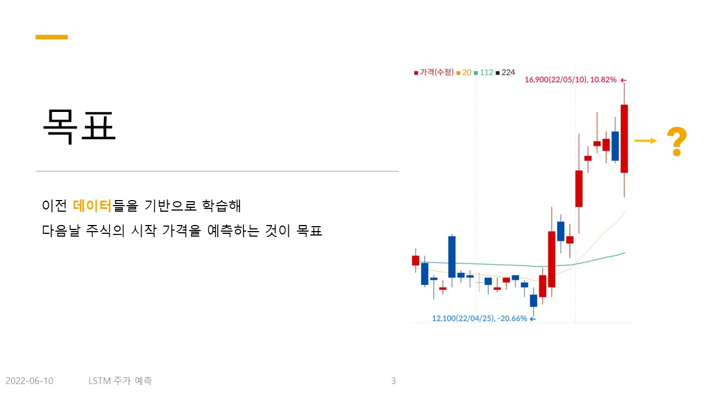
이전 50거래일 기록을 통해 내일의 시가를 예측 

<br/>

## LSTM 개념
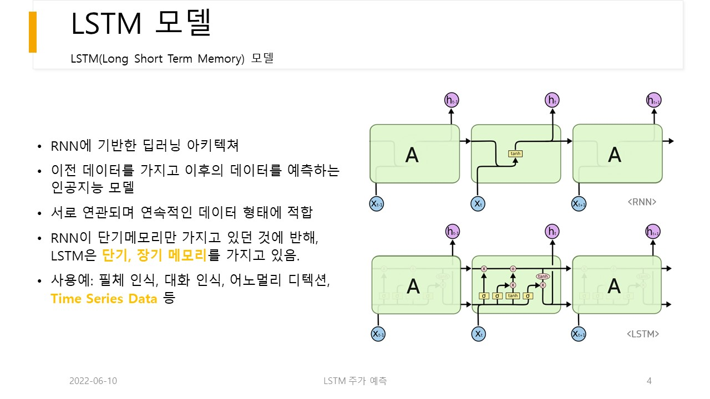
- RNN에 기반한 딥러닝 아키텍쳐
- 이전 데이터를 가지고 이후의 데이터를 예측하는 인공지능 모델
- 서로 연관되며 연속적인 데이터 형태에 적합
- RNN이 단기메모리만 가지고 있던 것에 반해, LSTM은 단기, 장기 메모리를 가지고 있음.
- 사용예: 필체 인식, 대화 인식, 어노멀리 디텍션, Time Series Data 등


<br/>
<br/>
<br/>

# 🛠 데이터 수집
## 데이터 수집 과정
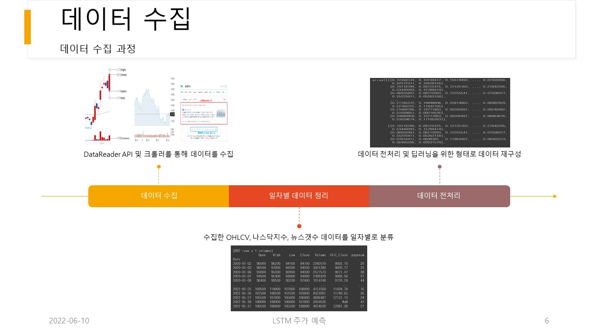

<br/>

## 수집할 데이터
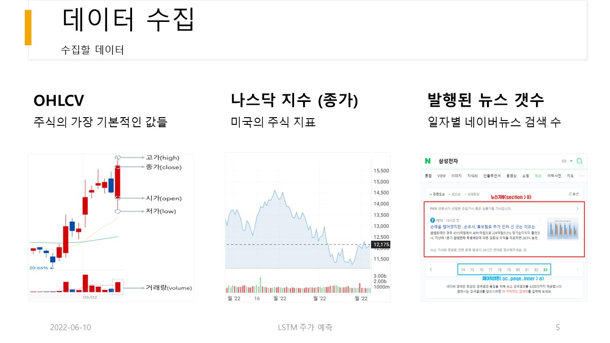
- OHLCV : 시가(open), 고가(high), 저가(low), 종가(close), 거래량(volume)
- 나스닥 지수(ixic_close)
- 해당종목의 발생된 뉴스 개수(pagenum)

### 수집된 데이터 예
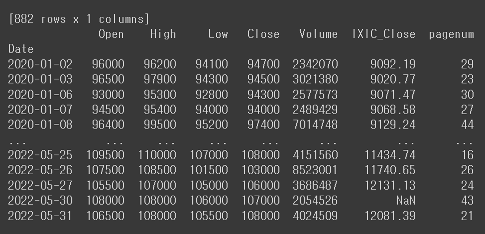


## 데이터 수집 코드
- call_dataset 함수 내부에서 데이터 수집을 처리하고 결과를 반환해준다.
- NaverNewsCrawling 은 자체 제작한 크롤링 모듈이다. (본 글에 data_collection > news 디렉토리에 위치함)

```python
def call_dataset(stock_name, stt='2020-01-01', end='2020-02-01', history_points=50):
    import data_collection.news.NaverNewsCrawling as NaverNewsCrawling

    # 이름으로 종목 정보 가져오기
    df_krx = fdr.StockListing('KRX')
    list_krx = {}
    for i in range(len(df_krx.Name)):
        list_krx[df_krx['Name'][i]] = {"code": df_krx['Symbol'][i], "sector": df_krx['Sector'][i]}

    ticker = list_krx[stock_name]["code"]
    print(stock_name, "의 종목코드는 ", ticker)

    # OHLCV 값 가져오기
    ohlcv = fdr.DataReader(ticker, stt, end)
    ohlcv = ohlcv.iloc[:, 0:-1]
    # ohlcv = ohlcv.loc[:,['Open','Close','Volume']]  # 시가, 종가, 거래량만 가져오기
    # print('ohlcv: ', ohlcv)

    # 나스닥 지수 (종가) 가져오기
    nasdaq = fdr.DataReader('IXIC', stt, end)
    nasdaq = nasdaq.loc[:, ['Close']]
    nasdaq.rename(columns={"Close": "IXIC_Close"}, inplace=True)  # 컬럼명 바꾸기
    # print('nasdaq: ', nasdaq)

    # 뉴스 갯수 가져오기
    nnc = NaverNewsCrawling()
    news_amount = nnc.get_news_amount_everyday_df(stock_name, stt, end)
    # print(news_amount)

    # 일자별로 데이터 합치기
    data_result = ohlcv.join(nasdaq).join(news_amount)
    data_result = data_result.fillna(method='ffill')  # 값(NaN)이 없는경우 이전일에서 데이터를 가져오도록함.
    print(data_result)
    data_result = data_result.values

    # 데이터를 0~1 범위로 스케일링
    data_normalizer = preprocessing.MinMaxScaler()
    data_normalized = data_normalizer.fit_transform(data_result)

    # 살펴볼 일수(window size = history_points) 단위로 데이터를 저장한다.
    ohlcv_histories_normalized = np.array(
        [data_normalized[i:i + history_points].copy() for i in range(len(data_normalized) - history_points)])

    # y_data (시초가)
    next_day_open_values_normalized = np.array(
        [data_normalized[:, 0][i + history_points].copy() for i in range(len(data_normalized) - history_points)])
    next_day_open_values_normalized = np.expand_dims(next_day_open_values_normalized, -1)  # 1XN 벡터 -> NX1 벡터로

    next_day_open_values = np.array(
        [data_result[:, 0][i + history_points].copy() for i in range(len(data_result) - history_points)])
    next_day_open_values = np.expand_dims(next_day_open_values, -1)  # 1XN 벡터 -> NX1 벡터로

    # 종가 데이터 기록
    close_values = np.array(
        [data_result[:, 1][i + history_points].copy() for i in range(len(data_result) - history_points)])
    close_values = np.expand_dims(close_values, -1)  # 1XN 벡터 -> NX1 벡터로

    # 데이터를 0~1 범위로 스케일링
    y_normalizer = preprocessing.MinMaxScaler()
    y_normalizer.fit(next_day_open_values)

    # 값 반환
    return ohlcv_histories_normalized, next_day_open_values_normalized, next_day_open_values, y_normalizer, close_values
```


<br/>
<br/>
<br/>

# 🎰 모델

## 컨셉
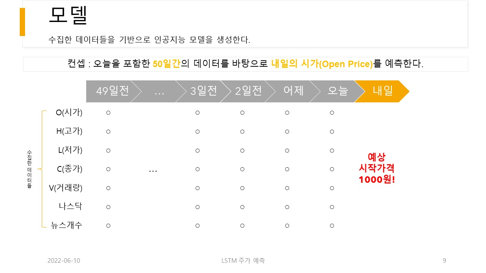
오늘을 포함한 50일간의 데이터를 바탕으로 내일의 시가(Open Price)를 예측하는 컨셉의 모델이다.

<br/>

## 학습 환경
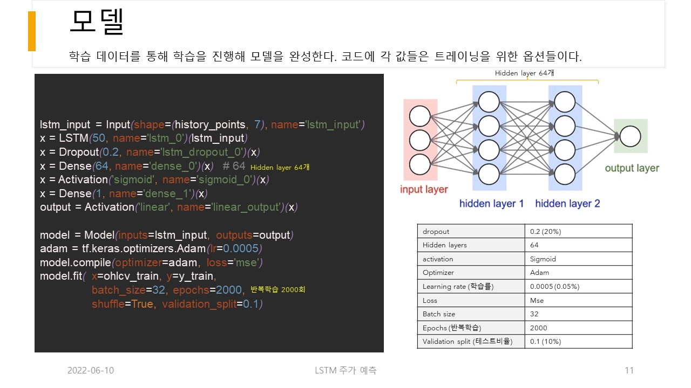
```python
lstm_input = Input(shape=(history_points, 7), name='lstm_input')
x = LSTM(50, name='lstm_0')(lstm_input)
x = Dropout(0.2, name='lstm_dropout_0')(x)
x = Dense(64, name='dense_0')(x)  # 64
x = Activation('sigmoid', name='sigmoid_0')(x)
x = Dense(1, name='dense_1')(x)
output = Activation('linear', name='linear_output')(x)

model = Model(inputs=lstm_input, outputs=output)
adam = tf.keras.optimizers.Adam(lr=0.0005)
model.compile(optimizer=adam, loss='mse')
model.fit(x=ohlcv_train, y=y_train, batch_size=32, epochs=2000, shuffle=True, validation_split=0.1)  # 반복학습 회수 = epochs.
  ```
	
- 입력데이터에 대한 0~1 MinMax Scale 전처리
- 64 hidden-layer
- Optimizer Adam 사용
- Dropout 20%
- 반복 학습 횟수 2000회

### 학습 진행 예
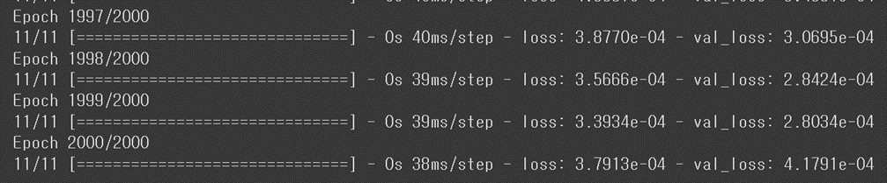


<br/>
<br/>
<br/>

# 🏃‍♂️예측 진행
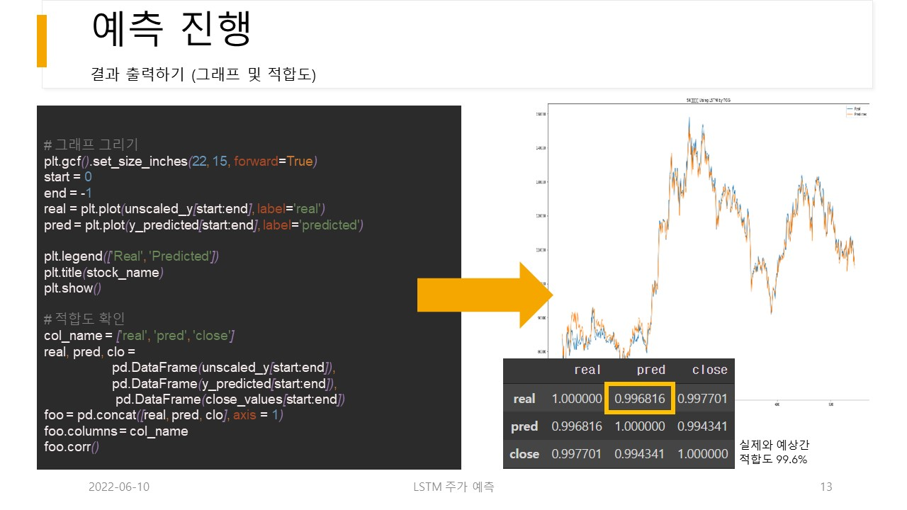

```python
plt.gcf().set_size_inches(22, 15, forward=True)

start = 0
end = -1
real = plt.plot(unscaled_y[start:end], label='real')
pred = plt.plot(y_predicted[start:end], label='predicted')

plt.legend(['Real', 'Predicted'])
plt.title(stock_name + ' Using LSTM by TGG')
plt.show()
```

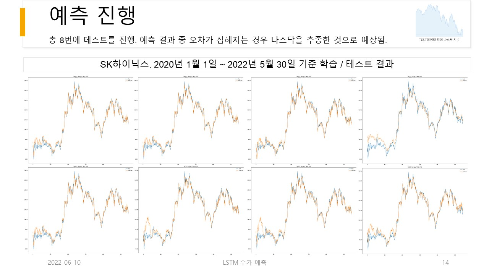


<br/>
<br/>
<br/>

# 예측 결과 및 개선 사항

## 예측 결과
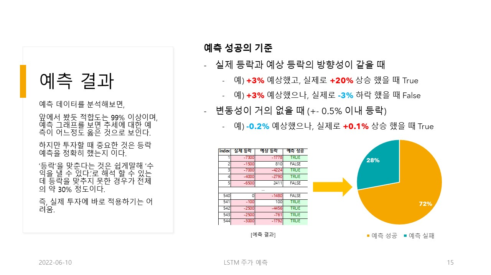

예측 데이터를 분석해보면,
앞에서 봤듯 적합도는 99% 이상이며, 예측 그래프를 보면 추세에 대한 예측이 어느정도 옳은 것으로 보인다.
하지만 투자할 때 중요한 것은 등락 예측을 정확히 했는지 이다.
‘등락’을 맞춘다는 것은 쉽게말해 ‘수익을 낼 수 있다.’로 해석 할 수 있는데 등락을 맞추지 못한 경우가 전체의 약 30% 정도이다.
즉, 실제 투자에 바로 적용하기는 어려움.

<br/>

## 개선 방향

- 학습에 사용되는 입력 데이터에 대한 고민이 필요함.
  - OHLCV만으로 예측하는 것이 오히려 더 좋은 결과를 보여줌.
- 실제 주가를 맞추는 것보다는 (즉, 오차를 줄이는것보단)
- 등락의 여부 자체를 맞추는 것이 오히려 투자에 도움이 됨. (방향만 맞추는 것)
- 즉, 오차를 줄이는 것 보단, 등락을 맞추는 것이 좋다. (오차 보다는 방향에 배점을 더 크게 두어야함)
- 위와 같은 이유로 y를 등락률 max(0.5)점 + 오차max(0.5점) = 1로 구성하는 식으로 하면 좋을 것 같음. (의견 ^^)
  - 즉 y = 등락(0.5점 상승0.5, 하락 0점을 배점?) + 다음날 시가(max 0.5 scale)

- 높은 적합도를 보였으나, 오차보다는 등락률 판단에 중점을 둬야 한다.
  - A모델: 예측 오차가 작은 모델
    - Ex) 주식을 100에 삼, A모델은 내일 시가를 99로 예측, 하지만 실제 시가는 101 (오차가 2지만, 손해발생)
  - B모델: 나에게 이득을 주는 모델 or 손해를 더는 모델
    - Ex) 주식을 100에 삼, B모델은 내일 시가를 101로 예측, 하지만 실제 시가는 110 (오차가 9지만, 이익발생)

- 내일의 가격은 이전 50거래일의 OHLCV, 나스닥, 뉴스갯수 외에 무엇에 영향을 받는가? 
  - 전날의 중국 항셍, 비트코인 증시 상황, 미국 국채 금리는?
  - IMF, 리먼브라더스, 오일쇼크, 코로나 쇼크 등 주식 외적으로 발생되는 이벤트들을 반영할 방법.

- 나스닥을 넣었더니 나스닥 값을 추종하며 오차 발생
  - 연관 관계를 파악해서 필요 없는 값을 제거하는 것도 하나의 방법이 될 듯.


<br/>
<br/>
<br/>


# 📊결과 상세
## 그래프
(SK하이닉스 2020년1월~2022년6월)
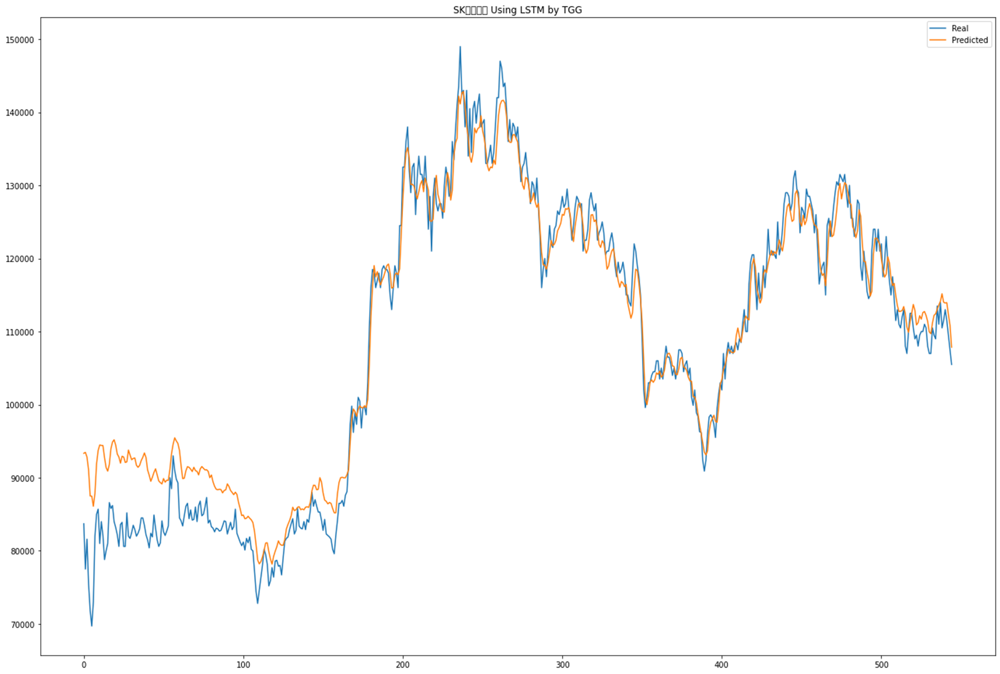
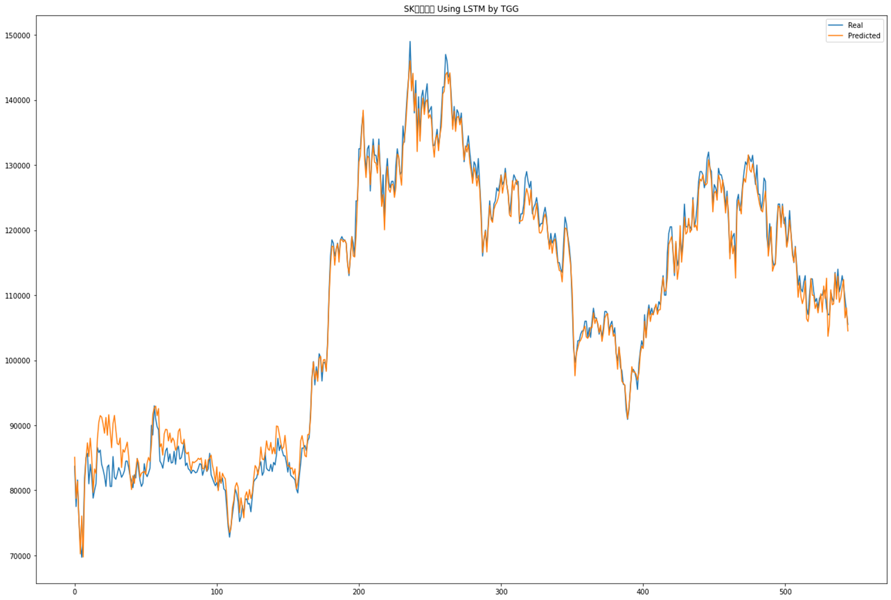
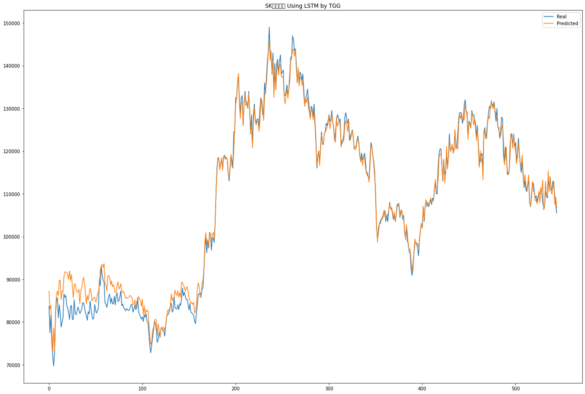

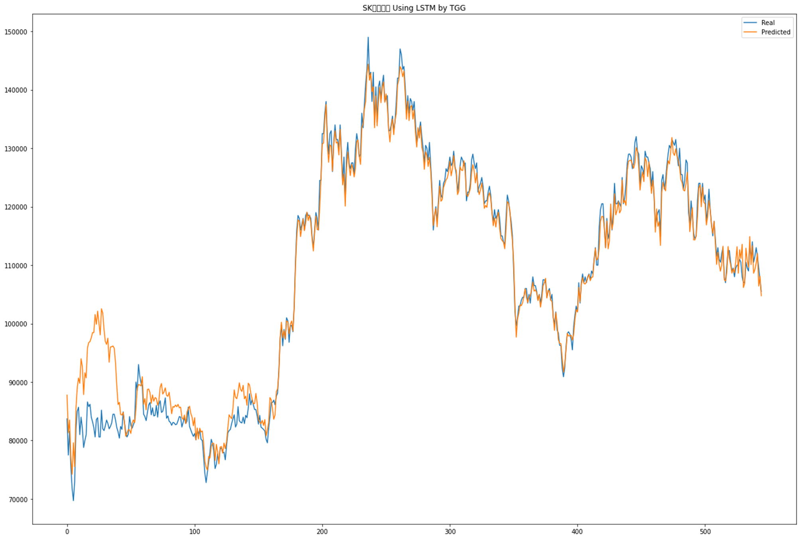

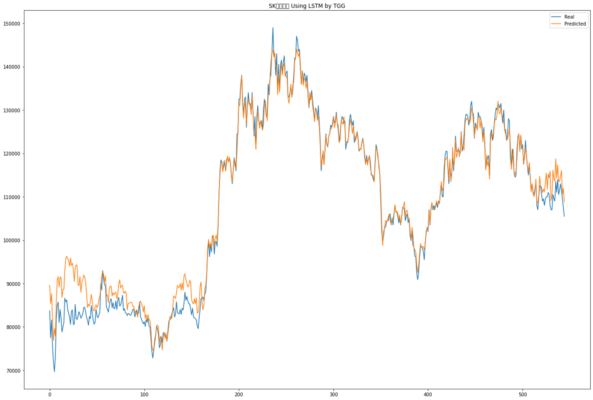


<br/>
<br/>
<br/>

# 📚참고자료

## 링크
[(칼럼) 딥러닝 초보들이 흔히하는 실수 : 주식가격 예측 AI](https://codingapple.com/unit/deep-learning-stock-price-ai/)

[시계열 예측: LSTM 모델로 주가 예측하기](https://insightcampus.co.kr/2021/11/11/%EC%8B%9C%EA%B3%84%EC%97%B4-%EC%98%88%EC%B8%A1-lstm-%EB%AA%A8%EB%8D%B8%EB%A1%9C-%EC%A3%BC%EA%B0%80-%EC%98%88%EC%B8%A1%ED%95%98%EA%B8%B0/)

[점프 투 파이썬](https://wikidocs.net/book/1173)

[기계학습: 주가 예측(선형회귀, 신경망) 시도](https://intrepidgeeks.com/tutorial/machine-learning-stock-price-prediction-linear-regression-neural-network-attempt)

[https://github.com/FinanceData/FinanceDataReader](https://github.com/FinanceData/FinanceDataReader)

[Stock-Prediction-Models/tesla-study.ipynb at master · huseinzol05/Stock-Prediction-Models](https://github.com/huseinzol05/Stock-Prediction-Models/blob/master/misc/tesla-study.ipynb)

[딥러닝 정확도 높이기](https://m.blog.naver.com/nanotoly/221497821754)

[점프 투 파이썬](https://wikidocs.net/36033)

[2. Keras LSTM 유형 정리 (2/5) - 단층-단방향 & many-to-many 유형](https://m.blog.naver.com/PostView.naver?isHttpsRedirect=true&blogId=chunjein&logNo=221589624838)

### RNN LSTM 주가 예측하기

실습하면서 진행한 코드 (RNN, LSTM 둘다있음)

[[텐서플로우2] RNN과 LSTM을 이용한 주식가격 예측 알고리즘 코드](https://diane-space.tistory.com/285)

RNN과 LSTM을 비교하면서 이론과 함께 설명 (처음보기는 복잡할수 있음)

[Tensorflow 2.0 Tutorial ch7.1 - RNN 이론 (1)](https://dschloe.github.io/python/tensorflow2.0/ch7_1_2_rnn_theory1/)

RNN LSTM 주가예측 개념적으로 쉽게 아주 잘 풀어냄 (예시코드 잇음)

[[LSTM/GRU] 주식가격 예측 모델 구현하기](https://data-analysis-expertise.tistory.com/67)

[Google Colaboratory](https://colab.research.google.com/github/teddylee777/machine-learning/blob/master/04-TensorFlow2.0/01-%EC%82%BC%EC%84%B1%EC%A0%84%EC%9E%90-%EC%A3%BC%EA%B0%80%EC%98%88%EC%B8%A1/02-LSTM-stock-forecasting-with-LSTM-financedatareader.ipynb#scrollTo=xShll_EX0l8T)

[KEKOxTutorial/22_Keras를 활용한 주식 가격 예측.md at master · KerasKorea/KEKOxTutorial](https://github.com/KerasKorea/KEKOxTutorial/blob/master/22_Keras%EB%A5%BC%20%ED%99%9C%EC%9A%A9%ED%95%9C%20%EC%A3%BC%EC%8B%9D%20%EA%B0%80%EA%B2%A9%20%EC%98%88%EC%B8%A1.md)

### RNN LSTM 기본 예제

움직이는 그림이 있는 예제

[[케라스] 무작정 튜토리얼 11 - LSTM(feat. RNN) 구현하기](https://ebbnflow.tistory.com/135)

글로 되어있으나 LSTM 입력데이터 형식 개념을 챙기는데 도움이 됨 (글짧음)

[Keras LSTM 입력 포맷의 이해 Understanding Input shapes in LSTM | Keras](https://swlock.blogspot.com/2019/04/keras-lstm-understanding-input-and.html)

LSTM 동작 구조에 원초적인 형태

[[머신러닝 순한맛] LSTM의 모든 것](https://box-world.tistory.com/73)

입력 데이터 정규화 해야하는 이유

[Neural Network 적용 전에 Input data를 Normalize 해야 하는 이유](https://goodtogreate.tistory.com/entry/Neural-Network-%EC%A0%81%EC%9A%A9-%EC%A0%84%EC%97%90-Input-data%EB%A5%BC-Normalize-%ED%95%B4%EC%95%BC-%ED%95%98%EB%8A%94-%EC%9D%B4%EC%9C%A0)

[주가 예측 딥 러닝을 위한 자료들](https://smecsm.tistory.com/54)

### 판다스 넘파이 데이터프레임

[[Pandas] loc[ ] 로 행, 열 조회하기](https://m.blog.naver.com/wideeyed/221964700554)

[Pandas - DataFrame 컬럼명, 인덱스명 변경](https://blog.naver.com/PostView.nhn?blogId=rising_n_falling&logNo=222061033231)

[Pandas DataFrame 인덱스 이름 가져 오기 및 설정](https://www.delftstack.com/ko/howto/python-pandas/pandas-get-and-set-index-name/)

[[Pandas] loc[ ] 로 행, 열 조회하기](https://m.blog.naver.com/wideeyed/221964700554)

[11. pandas DataFrame 인덱싱(열 / 행 / boolean 인덱싱)](https://nittaku.tistory.com/111)

[Python DataFrame 컬럼명 인덱스로 설정하기 set_index](https://ponyozzang.tistory.com/616)

[[Pandas 기초] 데이터프레임 합치기(merge, join, concat)](https://yganalyst.github.io/data_handling/Pd_12/#1-%EB%8D%B0%EC%9D%B4%ED%84%B0-%ED%94%84%EB%A0%88%EC%9E%84-%EB%B6%99%EC%9D%B4%EA%B8%B0--pdconcat)

[[Python pandas] 결측값 채우기, 결측값 대체하기, 결측값 처리 (filling missing value, imputation of missing values) : df.fillna()](https://rfriend.tistory.com/262)

## 논문

[LSTM 기반 감성분석을 이용한 비트코인 가격 등락 예측](https://www.dbpia.co.kr/Journal/articleDetail?nodeId=NODE10501339)

[[논문]주식시세 예측을 위한 딥러닝 최적화 방법 연구](https://scienceon.kisti.re.kr/srch/selectPORSrchArticle.do?cn=DIKO0014699312&dbt=DIKO#)
